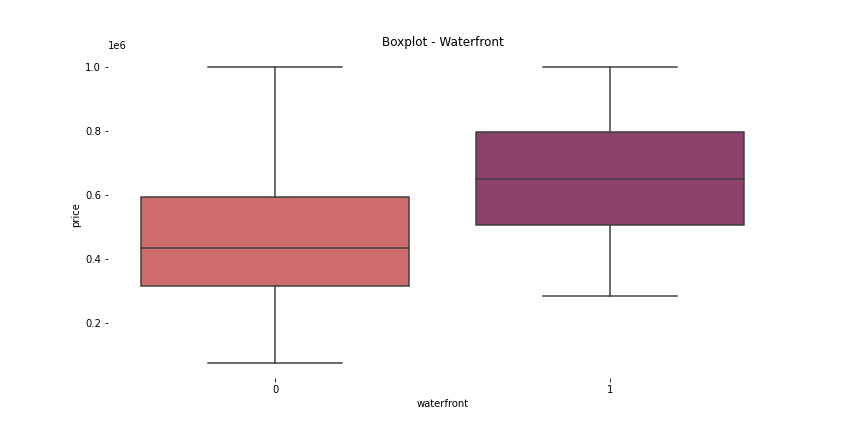
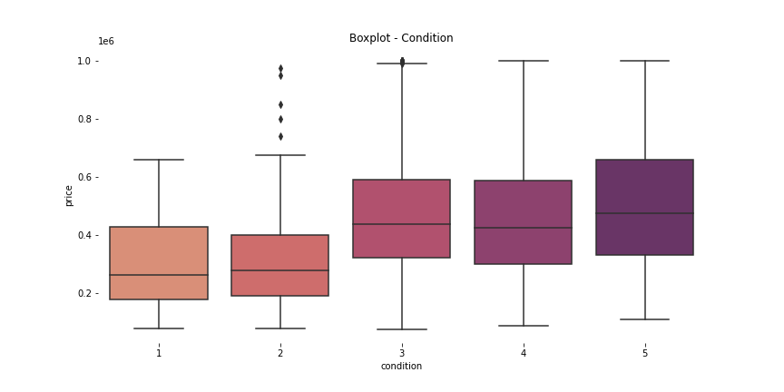
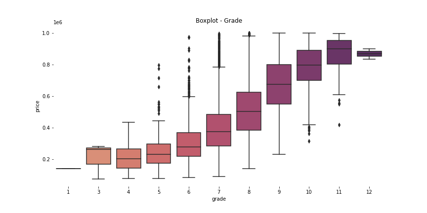
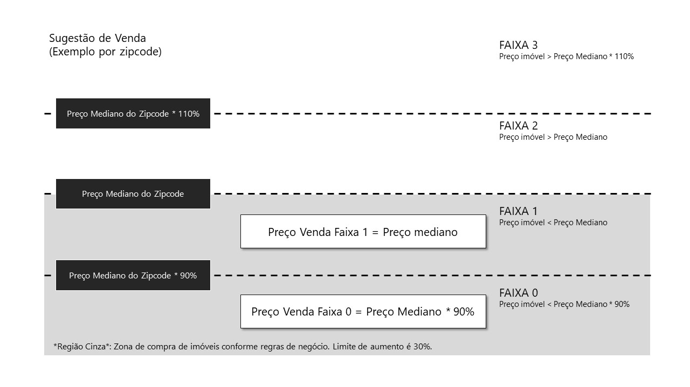

# Insights House Rocket Company

# 1. Problema de negócio

A ***House Rocket** (empresa fictícia)* é uma plataforma digital que tem como modelo de negócio, a compra e a venda de imóveis usando tecnologia.

A principal estratégia é comprar imóveis em ótimas localizações com preços baixos e revendê-los mais caros. O CEO da House Rokcet gostaria de maximizar a receita da empresa encontrando boas oportunidades de negócio

## 1.1 Desafio

Como Cientista de Dados, o meu objetivo é encontrar as melhores oportunidades de negócio respondendo as seguintes perguntas:

1. **Quais casas o CEO da House Rocket deveria comprar e por qual preço de compra?**
2.  **Uma vez a casa em posse da empresa, qual seria o preço da venda?**

# 2. Dataset

Para ajudar a responder essas perguntas, foi utilizado um *dataset* público disponível no [Kaggle](https://www.kaggle.com/harlfoxem/housesalesprediction).

| Variável | Definição |
| --- | --- |
| id | Identificador de cada imóvel. |
| date | Data em que a imóvel ficou disponível. |
| price | O preço de cada imóvel, considerado como preço de compra. |
| bedrooms | Número de quartos. |
| bathrooms | O número de banheiros, o valor 0,5 indica um quarto com banheiro, mas sem chuveiro. O valor 0,75 ou 3/4 banheiro representa um banheiro que contém uma pia, um vaso sanitário e um chuveiro ou banheira. |
| sqft_living | Pés quadrados do interior das casas. |
| sqft_lot | Pés quadrados do terreno das casas. |
| floors | Número de andares. |
| waterfront | Uma variável fictícia para saber se a casa tinha vista para a orla ou não, '1' se o imóvel tem uma orla, '0' se não. |
| view | Vista, Um índice de 0 a 4 de quão boa era a visualização da imóvel. |
| condition | Um índice de 1 a 5 sobre o estado das moradias, 1 indica imóvel degradado e 5 excelente. |
| grade | Uma nota geral é dada à unidade habitacional com base no sistema de classificação de King County. O índice de 1 a 13, onde 1-3 fica aquém da construção e design do edifício, 7 tem um nível médio de construção e design e 11-13 tem um nível de construção e design de alta qualidade. |
| sqft_above | Os pés quadrados do espaço habitacional interior acima do nível do solo. |
| sqft_basement | Os pés quadrados do espaço habitacional interior abaixo do nível do solo. |
| yr_built | Ano de construção da imóvel. |
| yr_renovated | Representa o ano em que o imóvel foi reformado. Considera o número ‘0’ para descrever as imóvel nunca renovadas. |
| zipcode | Um código de cinco dígitos para indicar a área onde se encontra a imóvel. |
| lat | Latitude. |
| long | Longitude. |
| sqft_living15 | O tamanho médio em pés quadrados do espaço interno de habitação para as 15 casas mais próximas. |
| sqft_lot15 | Tamanho médio dos terrenos em metros quadrados para as 15 casas mais próximas. |

# 3. Planejamento da solução

Para responder as perguntas do CEO, foi feita uma Análise Exploratória dos Dados (EDA) a fim de encontrar insights que possam ser acionáveis no negócio.

## 3.1 Processo

1. Entendimento das perguntas feitas pelo CEO
2. Coleta dos dados
3. Limpeza dos Dados
4. Levantamento de hipóteses sobre o comportamento do negócio
5. Análise Exploratória de Dados (EDA)
6. Identificação de Insights
7. Sugestões de soluções para o negócio

## 3.2 Ferramentas utilizadas

- Python, Pandas, Numpy e Seaborn
- Anaconda, VSCode e Jupyter Notebook
- Mapas interativos com Plotly e Folium
- Streamlit Python framework web
- Heroku Cloud

# 4. Top 3 Insights

1. **Imóveis com vista para água são 40% mais caros na média.**
    - Prospectar imóveis com vista para água que estejam com o preço menor que a mediana da região (zipcode)
        
        
        
    
2. **Imóveis com condition acima ou igual a 3 são 53% mais caros na média.**
    - Prospectar imóveis que estejam com condition acima oi igual a 3 e com preço menor que a mediana
        
        
        
    
3. **Imóveis com grade acima de 7 são 67% mais caros na média.**
    - Prospectar imóveis que estejam com o grade acima oi igual a 7 e com preço menor que a mediana
        
        
        

# 5. Resultado da solução

**Estratégia de compra:**

- Agrupar os imóveis por região (zipcode)
- Encontrar a mediana do preço do imóvel por região
- Sugerir a compra dos imóveis abaixo do preço mediano com condições acima ou igual a 3 ou vista para água ou grade acima de 7

**Estratégia de Venda:**

- Criar 4 faixas de preço, usando a mediana da região como referência
- Aumentar o valor de venda do imóvel até atingir a próxima faixa
- Limitar aumento do imóvel em 30%
    
    
    

Considerando as estratégias de compra e venda, o lucro total estimado é de aproximadamente $63,2 MM, com uma margem de lucro média de 7,6%. Para isso, deve ser prospectado aproximadamente 9,4% dos imóveis disponíveis no portfólio.

O aplicativo na cloud com a solução pode ser conferido em [Heroku](https://insights-hrocket.herokuapp.com/).

# 6. Próximos passos

- Previsão de preços: desenvolver um modelo de machine de learning para prever o valor dos imóveis e sugerir compra dos imóveis com erro positivo, isto é, imóveis que tem a previsão maior do que o valor real.
- Probabilidade de compra: se fosse possível obter dados do comportamento de compra dos clientes, seria possível desenvolver um modelo de machine learning para estimar a probabilidade de compra de cada imóvel. Com o modelo, seria possível precificar melhor o imóvel, o retorno de venda e rankear quais imóveis devem ser prospectados primeiro, caso haja limite de recursos operacionais para compra e venda dos mesmos.

# 7. Referências

- Este projeto de insights é um desafio da [Comunidade DS](https://www.comunidadedatascience.com/os-5-projetos-de-data-science-que-fara-o-recrutador-olhar-para-voce/).
- O conjunto de dados foi coletado no [Kaggle](https://www.kaggle.com/harlfoxem/housesalesprediction).
- O dicionário de dados foi obtido no [Geocenter](https://geodacenter.github.io/data-and-lab/KingCounty-HouseSales2015/).
